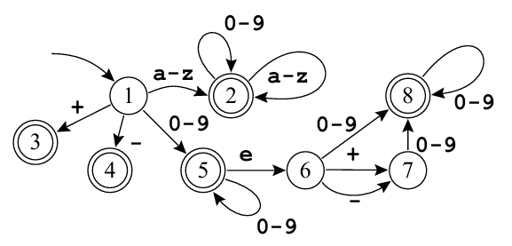

# Exercicio 01 - Lista 05

Créditos ao profº Wesley Attrot, autor do exercicio.

Escreva um programa que implementa o seguinte autômato:



O programa deve ler a sua entrada direto do teclado e imprimir um token por linha e chegar ao fim ao encontrar o símbolo de fim de arquivo (ctrl + z no Windows e ctrl + d no Linux). Para caracteres que não façam parte do alfabeto, o programa deve imprimir a mensagem ERRO. Quebras de linha devem ser ignoradas. Exemplo:

**Entrada**
```
+-abcabc@ abc
fgh
```

**Saida**
```
+
-
abcabc
ERRO
ERRO
abc
fgh
```