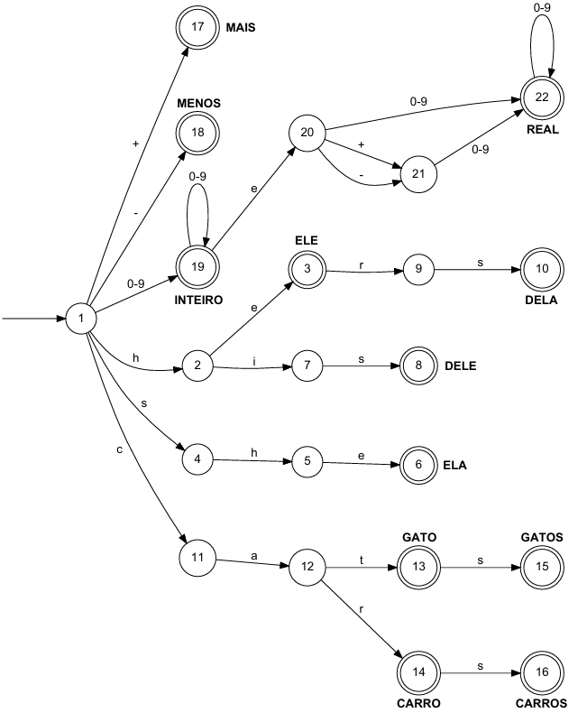

# Exercicio 01 - Lista 06

Créditos ao profº Wesley Attrot, autor do exercicio.

Implemente um analisador léxico que reconheça os tokens identificados no autômato apresentado ao fim deste texto. O analisador léxico deve ser implementado em C ou C++ e deve ler os dados da entrada padrão do sistema e imprimir o resultado na saída padrão.
Um exemplo de entrada para o léxico, bem como a saída esperada são apresentados a seguir.

**Entrada**
```
she 23 23e9 cathihis hers
cat cats @ A
```

**Saída**
```
ELA
INTEIRO 23
REAL 23e9
GATO
ERRO
ERRO
DELE
DELA
GATO
GATOS
ERRO
ERRO
```

Observe que espaços em branco e quebras de linha são descartados pelo analisador léxico.

