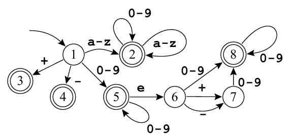

# Exercicio 01 - Lista 07

Créditos ao profº Wesley Attrot, autor do exercicio.

Utilizando a ferramenta Flex, escreva um arquivo .l para gerar um analisador léxico que implementa o seguinte autômato (mesmo da lista 5 exercicio 01): 



O programa deve ler da entrada padrão e imprimir um token por linha e chegar ao fim ao encontrar o símbolo de fim de arquivo. Para caracteres que não façam parte do alfabeto, o programa deve imprimir a mensagem ERRO. Quebras de linha devem ser ignoradas. Exemplo:

**Entrada**
```
+-abcabc@ abc
fgh
```

**Saida**
```
+
-
abcabc
ERRO
ERRO
abc
fgh
```