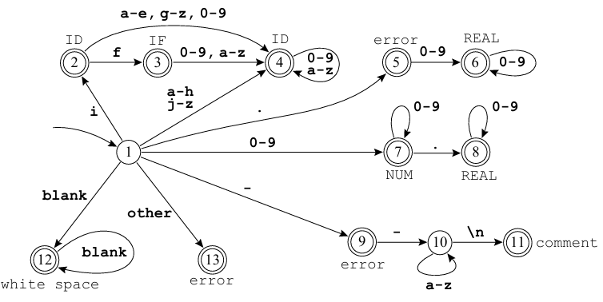

# Exercicio 02 - Lista 07

Créditos ao profº Wesley Attrot, autor do exercicio.

Utilizando a ferramenta Flex, escreva um arquivo .l para gerar um analisador léxico para o autômato a seguir:



O programa deve ler a sua entrada direto do teclado e imprimir um token por linha e chegar ao fim ao encontrar o símbolo de fim de arquivo. Quebras de linha que não estejam associadas ao token comment devem ser ignoradas. Exemplo:

**Entrada**
```
chuchu 666abobrinha@--blabla
0.0
```

**Saída**
```
chuchu ID
white space
666 NUM
abobrinha ID
@ error--blabla comment
0.0 REAL
```